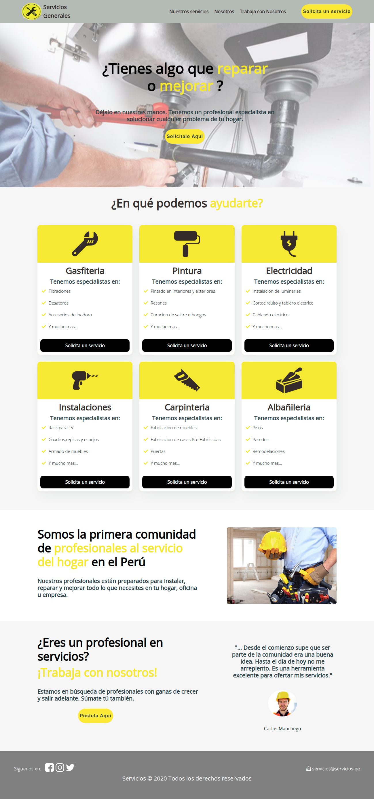
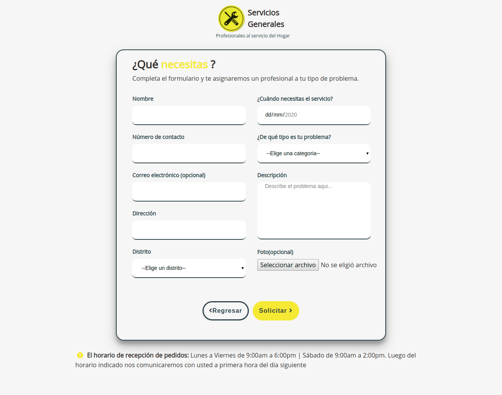
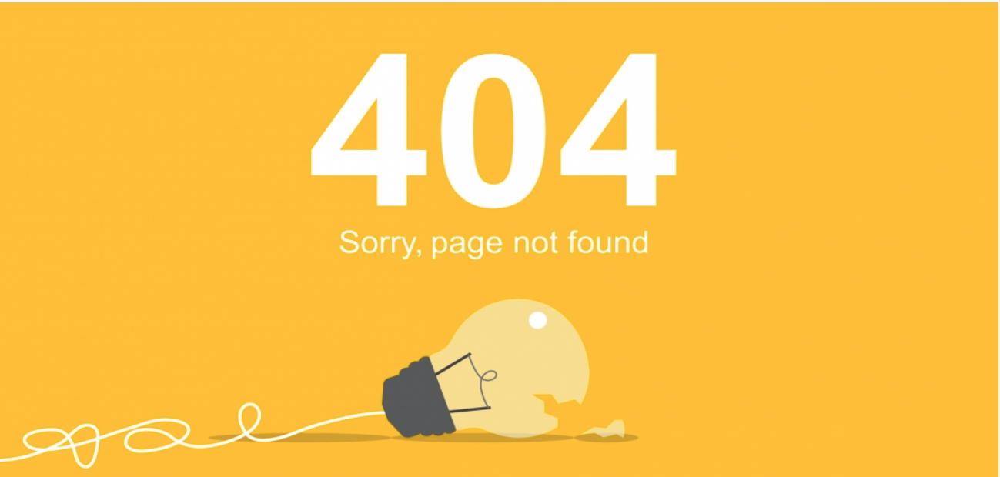

# Proyecto - Servicios generales
### El proyecto consta de 3 vistas:
- home
- solicita
- page404

# Home
1. Vista **/home** 
   - Se muestra los servicios que ofrece la pagina, el usuario al darle click en cualquier boton que indica `solicita un servicio` lo redireccionara a otra vista llamada **/solicita**
   

# Solicita
2. Vista **/solicita** 
   - Se ingresa los datos del usuario para solicitar un servicio 
   - Se construyó usando este [Backend](https://github.com/VanessaMMH/Backend) desarrollado en java.

# Page404
3. Vista **page404** (Cualquier ruta)
   - Esta vista solo aparecera si el usuario ingresa *cualquier ruta* que no esta indicada
   

